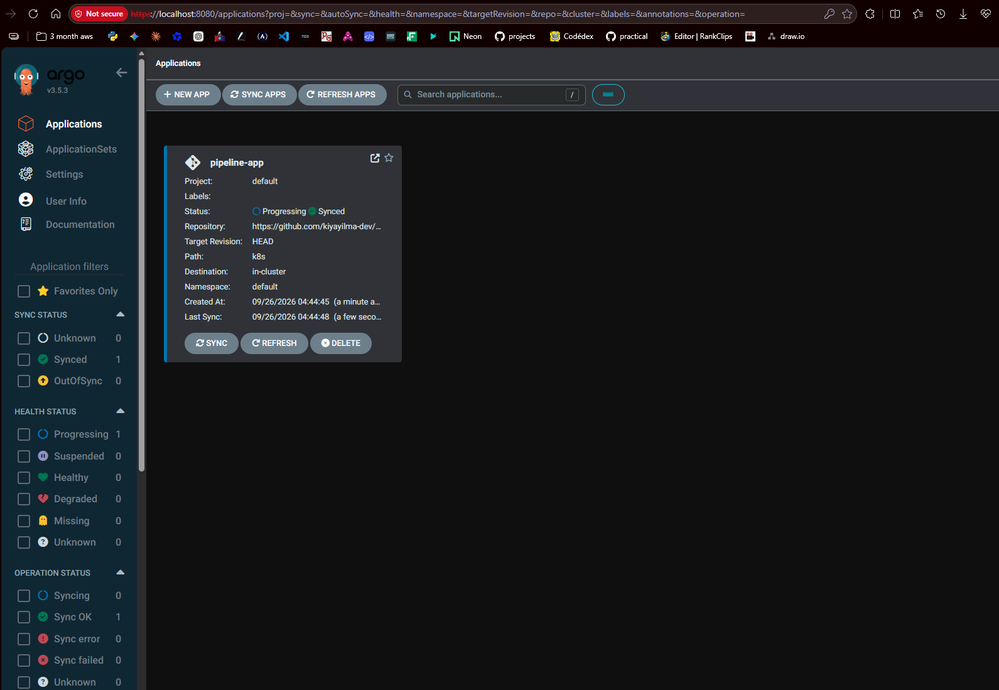
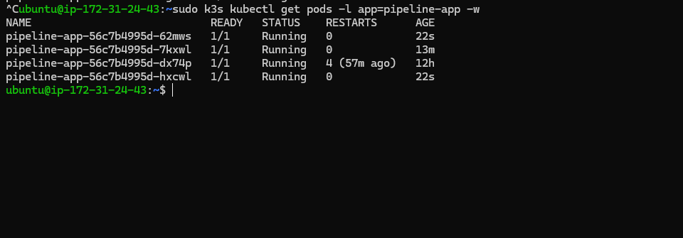
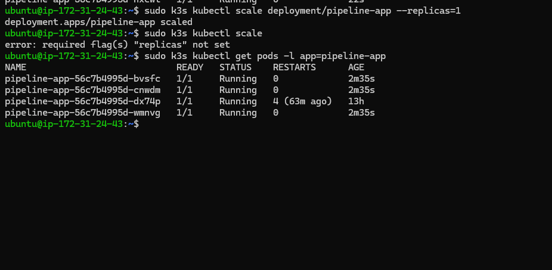
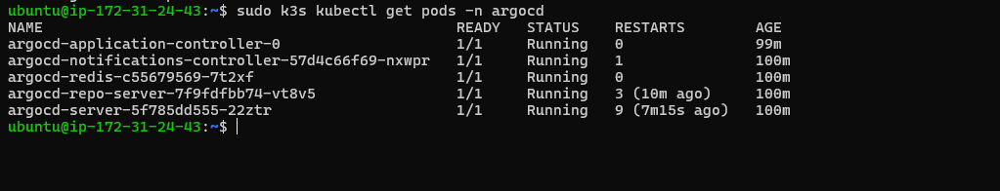

# GitOps Continuous Deployment Platform


A GitOps-driven continuous deployment pipeline for Kubernetes, using ArgoCD to keep a live cluster in continuous sync with a Git repository — including verified, automated correction of manual drift. Git is the only source of truth here; nothing is deployed by a person running `kubectl apply`.

## 📐 Architecture

```
   Developer
       │
       ▼
   git push
       │
       ▼
GitOps Repository (this repo)
       │
       ▼
  ArgoCD (watches, syncs, self-heals)
       │
       ▼
Kubernetes Cluster (k3s on AWS EC2)
       │
       ▼
   pipeline-app Pods
```

ArgoCD continuously compares the live cluster state against this repository's `k8s/` manifests. Any difference — whether from a new commit or a manual `kubectl` change — is automatically reconciled back to match Git.

## ️ Screenshots

**ArgoCD dashboard — Synced and Healthy**


**Deployment triggered purely by `git push`**


**Self-healing drift correction — manual scale reverted automatically**


**Initial ArgoCD Pod Health**


## 🗂️ Project Structure

```
gitops-continuous-deployment-platform/
├── k8s/
│   ├── deployment.yaml       # Application desired state (source of truth)
│   └── service.yaml          # Network exposure (NodePort)
├── applications/
│   └── pipeline-app.yaml     # ArgoCD Application CRD — points ArgoCD at k8s/
└── README.md
```

## 🧩 Engineering Challenge: Right-Sizing Infrastructure Under Real Load

Running ArgoCD alongside k3s on a 1 GiB RAM `t2.micro` instance exposed a hard resource ceiling: the API server began intermittently timing out, SSH sessions dropped mid-command, and CoreDNS and metrics-server pods cycled between `Running` and `0/1` under memory pressure.

**Diagnosis process:**

- Confirmed disk space was not the issue.
- Used `free -h` to confirm the instance was under heavy swap pressure with under ~900 MiB of usable RAM.
- Before touching anything further, identified the true owner of an orphaned `metrics-server` pod via `kubectl get pod ... -o jsonpath='{.metadata.ownerReferences}'` rather than deleting resources blindly under pressure — the pod was owned by a `ReplicaSet` that no longer had a matching `Deployment`, explaining why it kept reappearing.

**Root cause:** the workload (k3s control plane + ArgoCD's several components) simply exceeded what 1 GiB of RAM can reliably hold — swap can mask this temporarily, but under real load it just delays the same failure and adds latency severe enough to cause SSH and API timeouts.

**Fix applied:** resized the instance from `t2.micro` to `t3.small` (2 vCPU / 2 GiB RAM) via **EC2 → Instance state → Stop → Actions → Instance settings → Change instance type → Start**, then reinstalled ArgoCD cleanly on the added headroom.

This is the difference between patching a symptom and fixing the actual constraint — swap, restarts, and selectively deleting pods only bought time; the real fix was acknowledging the workload didn't fit the instance and right-sizing it.

## ✅ GitOps, Verified Two Ways

**1. Deploy purely via Git**

```bash
git add k8s/deployment.yaml
git commit -m "Scale pipeline-app to 4 replicas"
git push
```

ArgoCD detects the commit and syncs automatically — no `kubectl apply` involved.

**2. Self-healing drift correction**

```bash
kubectl scale deployment/pipeline-app --replicas=1
kubectl get pods
# briefly shows 1 pod, then ArgoCD reverts it back to the replica count defined in Git
```

This is the core GitOps guarantee: the cluster cannot drift from the declared desired state, even under direct manual intervention.

## 🛠️ Tech Stack

- **GitOps Engine:** ArgoCD
- **Orchestration:** Kubernetes (k3s)
- **Cloud Provider:** AWS EC2
- **Application:** Node.js, Express (containerized, pulled from Docker Hub)

## ▶️ How to Deploy

```bash
kubectl create namespace argocd
kubectl apply -n argocd -f https://raw.githubusercontent.com/argoproj/argo-cd/stable/manifests/install.yaml
kubectl apply -f applications/pipeline-app.yaml
kubectl get applications -n argocd
```

Access the ArgoCD UI via an SSH tunnel (never expose it directly to the internet):

```bash
kubectl port-forward svc/argocd-server -n argocd 8080:443 &
ssh -i devops-track-key.pem -L 8080:localhost:8080 ubuntu@<instance-ip>
# then open https://localhost:8080
```

## 🔑 Key Learnings

- **GitOps principles** — Git as the single, immutable source of truth for cluster state, with ArgoCD as the reconciliation engine rather than a person or a CI job pushing changes imperatively.
- **Drift detection and self-healing** — configured and verified `syncPolicy.automated.selfHeal`, proving the cluster actively resists manual configuration drift.
- **Capacity planning under real constraints** — learned to recognize when a problem is architectural (workload doesn't fit the instance) rather than something more swap, more restarts, or more patience can solve.
- **Safe incident response** — under cluster instability, identified an orphaned resource's true owner via `ownerReferences` before deleting anything, avoiding compounding the problem with guesswork.

## 🚧 Future Improvements

- [ ] Add ArgoCD ApplicationSets for multi-environment (dev/staging/prod) management
- [ ] Introduce Sealed Secrets so sensitive values can live safely in the Git repo
- [ ] Wire ArgoCD notifications to Slack or email on sync and health-status changes
- [ ] Adopt Argo Rollouts for progressive/canary delivery instead of a plain Deployment
- [ ] Right-size back down to `t2.micro` post-demo, or move to a Reserved Instance if kept running long-term

## 👨‍💻 Author

**Kiya Yilma Regasa**
Cloud & DevOps Engineer

[GitHub](https://github.com/kiyayilma-dev)
